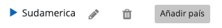

# DATA WAREHOUSE

This project was done using HTML, CSS, Sass, Bootstrap and Javascript in Front-end and Node.JS with Express, MongoDB and Mongoose in Back-end.   Author: julianaquiroz18   License: MIT

## How to test it?
Clone the repository and follow next steps:

1. Install Front-end dependencies:
```bash
    #Go to Data warehouse FE folder
    cd Data_warehouse_FE
    #Install dependencies
    npm install
```

2. Preparing enviroment:
```bash
    #Go back to main folder
    cd ..
    #Go to Data warehouse BE folder
    cd Data_warehouse_BE
    #Rename file `sample.env` to `.env`
    mv sample.env .env 
    #Modify your .env information 
```


3. Install Back-end dependencies and start server:

```bash
    #Install dependencies
    npm install
    #Initialize data base
    #Note: Admin email and password would be provided  
    node bootstraping.js 
    #Initialize server
    npx nodemon server.js
```
4. Use your browser to access: http://localhost:<your .env provided port>/

5. Use credentials provided to bootstraping script to access to Data Warehouse app.

## NOTE:
All information is related, therefore you will need to add all the information required (Regions, Countries, Cities, Companies) before create contacts.   

## NOTE:
At first glance user can't add few information:  

  

However if user do hover the parent node, add button will appear  

